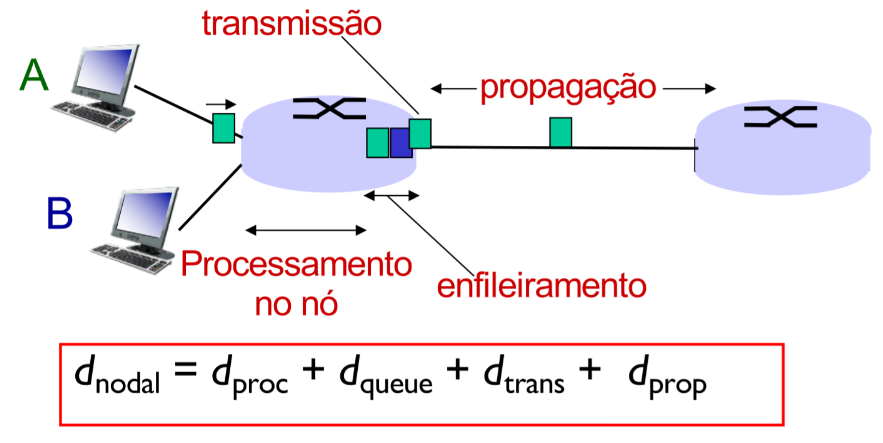
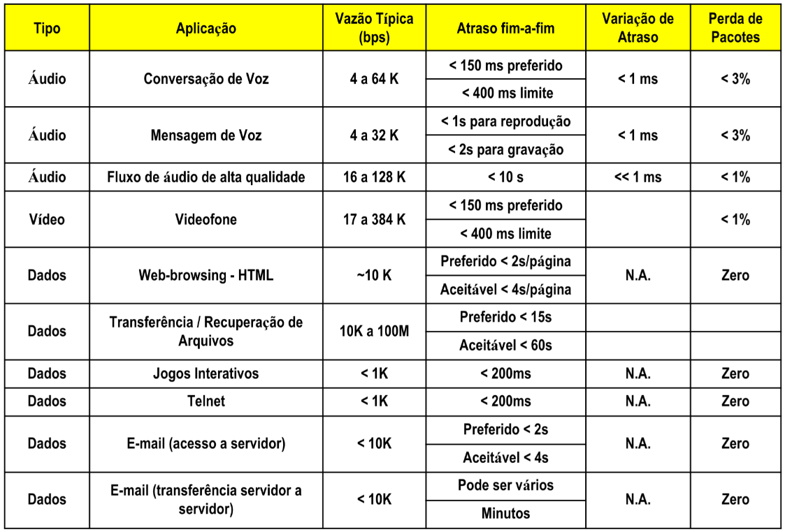

# Pârametros de Qualidade de Serviço

Objetivos:

- Especificar os requisitos de uma aplicação sobre a rede;
  - Geralmente feito por meio de SLAs (Service Level Agreements);
- Qualificar o estado de uma rede.

Tipos:

- Disponibilidade: porcentagem de tempo que a rede fica disponível;
- Atraso de Trânsito: tempo que a rede demora para transportar uma unidade de dados da origem ao destino;
- Jitter: variação do atraso de trânsito;
- Taxa de erro: porcentagem total de objetos com erro em relação aos transmitidos;
- Precisão: porcentagem do tempo sem erros na transmissão e entrega de informação;
- Vazão: taxa em que eventos orientados à aplicação ocorrem;
- Utilização: porcentagem da capacidade teórica de um recurso que é efetivamente utilizada.

## Vazão

Taxa (bits / unidade de tempo) na qual os dados são transferidos do transmissor para o receptor.

> Vazão total é sempre limitada pelo link de menor vazão

Parâmetro mais básico de QoS, toda aplicação gera uma vazão que deve ser atendida pela rede.

## Latência

Atraso (em unidade de tempo) que demora para os dados transmitidos chegarem ao receptor.

Componentes:

1. Transmissão: Tamanho do pacote (bits) / Banda do link (bps)
1. Propagação: Comprimento do link (m) / Velocidade de propagação (~2e8 m/s)
1. Filas de Processamento
    1. Processamento em Nó: Verificar bits de erro e determinar link de saída (ordem menor que ms)
    1. Enfileiramento: Tempo de espera no link de saída

### Atraso na Fila

La/R ~ 0: Pouco atraso na fila
La/R -> 1: Atraso na fila grande

Onde `L` é o tamanho do pacote (bits), `a` é a taxa média de chegada de pacotes e `R` é a banda do link (bps).

### Processamento de Pacotes

Pacotes processados em:

- Roteadores
- Switches
- Servidores de acesso remoto
- Firewalls

No caso de latência fim-a-fim, deve-se considerar o tempo de processamento nos hosts (especialmente servidores).

## Jitter

Variação no atraso percebido pelo receptor ao receber os pacotes.

Causas:

1. Variação de carga sobre roteadores ou switches
1. Alteração na rota de pacotes

Combinação dos dois fatores pode levar a alteração da sequência de pacotes.

Mitigar:

- Buffer de backlog no receptor. Controla localmente a frequência com que os pacotes são entregues ao usuário, mas aumenta um pouco a latência.

- TCP trata perda de sequência automaticamente.

## Taxa de Erro

Causas:

- Ruídos e interferências na transmissão física dos bits

BER = Total de bits recebidos com erro / Total de bits recebidos

BER na faixa de 1e-6 ~ 1e-12

## Taxa de Perda

Causas:

- Taxa de erro (BER) que provoca o descarte do pacotes;
- Descarte de pacotes quando os buffers de recepção dos roteadores ficam cheios;
- Falhas e inconsitências momentâneas em tabelas de roteamento;
- Falhas em roteadores, que podem ocasionar em perdas de pacotes ou pacotes duplicados (devido a retransmissão na camada de transporte e/ou aplicação).

Taxa de perda = ( Pacotes perdidos + Pacotes duplicados + Pacotes com erro ) / Total de pacotes

## Diponibilidade

Tempo que a rede está disponível para o usuário.

- Redundância
- Confiabilidade dos equipamentos
- Qualidade e confiabilidade dos sub-serviços contratados
- Capacidade operacional de lidar com falhas

## Aplicações e sumário

