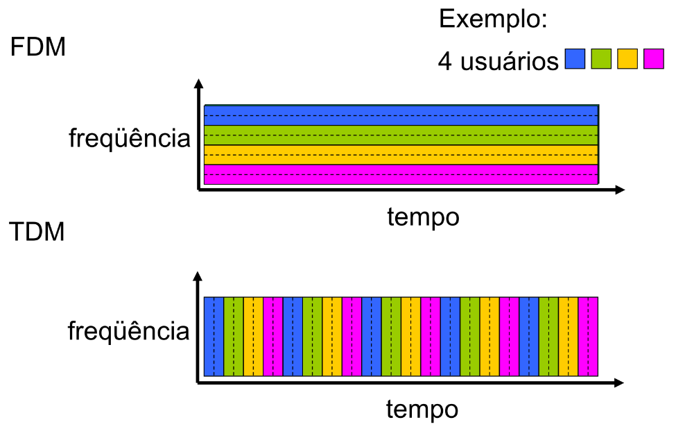

# Comutação

**Redes de Computadores**: conjuntos de computadores interligados por meio de **Redes de Comunicação de Dados**.

**Redes de Comunicação de Dados**: estruturas de equipamentos de transmissão de dados interligados por diversos tipos de meios físicos de comunicação de dados,

**Técnicas de Comutação**: técnicas para compartilhar essas estruturas de comunicação de dados entre
vários usuários.

## Comutação de Circuitos

Núcleo da rede: Links compostos por N circuitos, onde os circuitos são reservados fim-a-fim para comunicação entre origem e destino.

Características:

- Conexão fim-a-fima;
- Usado em redes telefônicas tradicionais;
- Capacidade fixa;
- Tarifação baseada na distância e no tempo de conexão.

Vantagens:

- Adequado para taxa de transmissão fixa e alto índice de utilização;
- Suporta aplicações sensíveis a atrasos (voz);
- Recursos dedicados, levando a desempenho garantido, como em um circuito físico;
  - Não tem problemas de congestionamento.

Desvantagens:

- Inadequado para tráfego em rajadas (burst);
- Impossibilidade de estabelecer conexão no caso de indisponibilidade de recursos (depende de ter slots livres para se comunicar);
- Slots não utilizados ficam ociosos.

### Multiplexação

TDM:

- Estática;
- Se não tiver nada para transmitir, o slot fica alocado, mas vazio.

## Comutação de Pacotes

Núcleo da rede: Malha de roteadores interconectados. Hosts quebram mensagens em pacotes que são encaminhados pelos roteadores da rede até chegar ao destino. Cada pacote utiliza a capacidade total do link.

- Roteamento: Determina a rota seguida pelos pacotes;
- Encaminhamento: Move pacote de uma interface de entrada do roteador para a interface de saída correta.

Características:

- Várias conexões lógicas em uma mesma conexão física;
- Tráfego agregado estatisticamente;
- Store-and-forward;
  - Pacote inteiro deve chegar no roteador para ser transmitido. Atraso fim-a-fim = 2*L/R;
- Tarifação baseada no tráfego e tempo de conexão;

Vantagens:

- Tráfego em rajadas;
- Permite rotas alternativas;

Desvantagens:

- Não suporta aplicações sensíveis a atraso;
- Perda de pacotes devido a congestionamento;
  - Se taxa de chegada de pacotes (em bits) for maior que a taxa de saída, pacotes são colocados na fila;
  - Se fila exceder o tamanho máximo do buffer, pacotes novos são descartados;
- Perda de sequência dos pacotes requer reordenação.

<!-- markdownlint-disable MD024 -->
### Multiplexação

TDM:

- Estática ou dinâmica;
- Só transmite quando houver dados;
- Slot de tempo alocado dinamicamente;
  - Cabeçalho para identificar pacotes.

## Comutação de Células

Características:

- Evolução, faz uso da alta confiabilidade dos meios de transmissão atuais;
- Opera apenas com células de tamanho fixo, reduzindo overhead de processamento dos pacotes;
- Alocação dinâmica de banda de transmissão;
- Suporta tráfego com taxa de bit constante ou variável.

Vantagens:

- Baixo overhead de processamento;
- Suporta serviços de dados, voz e vídeo;
- Possibilita a integração de redes e sistemas de comunicação.

Desvantagens:

- Alto overhead de cabeçalho;
- Não opera de maneira otimizada para nenhum tipo de serviço específico;
- Requer infraestrutura de comunicação com poucos erros e altas taxas de transmissão.

Ex: Redes ATM (Asynchronous Transfer Mode)

## Comutação de pacotes vs de circuitos

- Comutação de pacotes permite que mais usuários usem a rede;
- Comutação de pacotes é ótima para burts e não necessita de estabelecimento de conexão;
- Comutação de pacotes precisa de protocolos de transferência confiável de dados (TCP) e de controle de congestionamento;
- Necessário garantias de banda para aplicação de áudio e vídeo na comutação de pacotes (para ter comportamento similar a comutação de circuitos).
  - Problema não resolvido!
