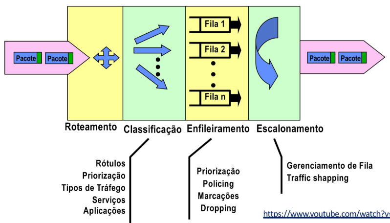
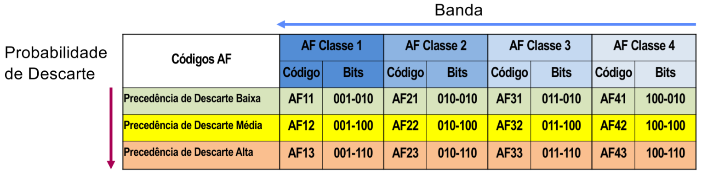

# Redes WAN

## Redes Convergentes

As redes convergentes são aquelas que suportam aplicações multimídia, de voz e de comunicação de dados (com suas respectivas necessidades de QoS) numa única infraestrutura.

Exemplos:

- Frame Relay
- ATM (Asynchronous Transfer Mode)
- IP

Benefícios:

- Não desperdiçam banda como redes de comutação de circuitos tradicionais;
- Infraestrutura de redes única para todas as aplicações;
  - Fim da sobreposição de redes, que geram custos elevados para manter os recursos multiplicados;
- Interface de redes padronizada para voz, vídeo e dados;
- Uso de tecnologias abertas (IP).

Possiblitado por:

- Melhorias nos roteadores e switches;
  - Switches programaveis cada vez mais baratos;
- PDS cada vez mais poderosos;
- Transmissão digital cada vez mais veloz (protocolos como DWDM);
- Novos protocolos/tecnologias para melhorar transmissão de aplicações de voz e vídeo em redes de dados (MPLS, RSVP);
- Tecnologias de compressão de voz e imagem.

## Aplicações e seus requisistos de QoS

| Aplicações Quesitos | Dados | Dados Gráficos | Voz (Som) (Música) | Voz Interativa (Telefonia) | Vídeo (TV Digital) (IPTV) | Vídeo Tempo Real (Vídeo Conferência) |
|---|---|---|---|---|---|---|
| Vazão/Banda | PE | E | E | PE | ME | E |
| Atraso | PE | PE | PE/E | ME | PE/E | ME |
| Variação do Atraso | PE | PE | ME | ME | E | ME |
| Taxa de Erro | ME | ME | E | PE | ME/E | ME/E |

PE: Pouco Exigente; E: Exigente; ME: Muito Exigente.

## Arquitetura Geral e Mecanismos de Controle de QoS

Objetivo do Controle de QoS: Implementar serviços com QoS específico para cada tipo ou classe de fluxo/tráfego.

| Parâmetros de QoS | Mecanismos de QoS |
|---|---|
| Atraso | Priorização de dados de acordo com a categoria do canal. Ex: rt-VBR > nrt-VBR |
| Variação de Atraso | Mecanismos de Sincronização Ex: time stamp. |
| Banda | Reserva de banda por meio de sinalização. |
| Confiabilidade | Detecção e correção de erros. |

OBS: Sinalização é a troca de informações entre elementos de rede para configurar um certo serviço edge-to-edge

Tarefas de controle de QoS no roteador:

OBS: Classificação normalmente ocorre nos roteadores de borda, o mais próximo possível da aplicação. Os roteadores do núcleo apenas fazem as outras etapas para pacotes já classficados.

Tecnologias:

- Alta velocidade que suportam alguma integração e convergência de aplicações: Frame Relay;
- Suportam controle de QoS nativamente: ATM;
- Camada 2:
  - Controle de QoS em LANs: Padrões IEEE 802.1 Q/p;
  - Redes WLAN 802.11: Controle de tempo entre frames;
  - GSM/GPRS, 3G/4G, 5G: Mecanismos de negociação, mapeamento em fluxos IntServ e DiffServ;
- **Tecnologias IP** discutidas em detalhe na próxima seção.

## Tecnologias IP para Redes Convergentes

Mecanismos de controle de QoS:

- RTP, RTCP (Real Time Protocol, Real Time Control Protocol) - Protocolos de Monitoração de QoS fim-a-fim
- Arquiteturas borda-a-borda:
  - IntServ (Integrated Services);
  - DiffServ (Differentiated Services);
  - RSVP (Resource Reservation Protocol) - Procolo de sinalização;
- MPLS (Multiprotocol Label Switching) - Implementação de Circuitos Virtuais sobre redes IP;
- Tecnologias para Engenharia de Tráfego.
- **IPv6**

### DiffServ

Modelo de rede para QoS edge-to-edge.

Especifica comportamento per-hop (PHB - Per-Hop Behavior).

Porvedores combinam PHBs para implementar os serviços edge-to-edge.

Domínio DiffServ: Rede com regras de mapeamento e mecasismos DiffServ.

- Conjunto de Domínios DS formam Região DS;
- Operador/administrador garente que o serviço end-to-end esteja dentro do previsto;
- Roteadores ao redor de um donínio são os Boundary Routers (de borda);
- Tráfego entra pelos Ingress Routers (Ingresso) e sai pelos Egress Routers (Egress).

Microfluxo: Fluxo aplicação - aplicação.

DS Behavior Aggregate (BA): vários microfluxos com mesmo QoS.

Abordagem básica:

DiffServ define um conjunto pré-definido de fluxos (classes de tráfego) e define os mecanismos sobre essas classes. Classes diferentes possuem características de tratamento específicas (ex: prioridade em descarte e alocação de banda).

- Roteador de Borda:
  - Classificação: mapeamento das classes;
  - Condicionamento: verificação de confromidade ao acordo (TCA) e descartes;
- Roteador do Núcleo:
  - Apenas reencaminha de acordo com as regras pré-determinadas para cada classe/fluxo.

#### Condicionamento

- Principal função do DiffServ. Compreende:
  - Classificação do pacote: com base em CoS, endereços, portas, etc;
  - Marcações com código DSCP (DiffServ Code Point);
  - Policing (verifica se os níveis de consumo de banda estão acima do acordado para aquela classe de serviço);
  - Traffic shaping (smooth na vazão por meio de bursts e controle);
- Regras estão no TCA (Traffic Conditioning Agreements);
- Função executada pelos Ingress Routers;

#### PHB

Per-Hop Behavior (PHB): enfileiramento, gerenciamento de fila e policing.

Os PHBs são indicados por valores específicos de DSCP. Grupos de PHBs podem ter vários códigos de DSCP.

- PHB Default: Padrão de comportamento antigo "Best efort".
  - Nenhum tratamento;
  - Enviado o quanto antes;
  - Outras classes tem maior piroridade, mas ainda precisa ser alocado um mínimo de banda para esse PHB

- Class Selector (CS): Compatibilidade com os comportamentos antigos do Tos do IPv4.

- Assured Forwarding (AF PHB): Grupo para serviços edge-to-edge especificados em termos de largura de banda. São especificadas 4 classes de tráfego com 3 níveis de precedência de descarte (baixa, média, alta).

- Expedited Forwarding (EF PHB): Reencaminhamento imediato, usado para serviços de baixo atraso e jitter.
