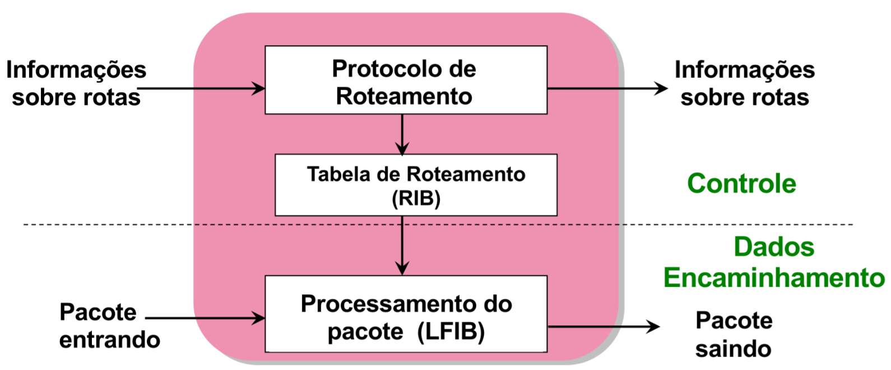

# MultiProtocol Label Switch (MPLS)

## Visão Geral

Label Based Switching (LBS):

- Cria um circuito virtual por meio de um rótulo (label) que substitui internamente as informações de nível 3.
- Torna mais rápido o processo de comutação.
- Separa roteamento (Plano de Controle) de comutação (Plano de Dados).
- Permite implementação de Engenharia de Tráfego, controle de QoS e VPNs.

MultiProtocol Label Switch (MPLS):

- Cria rotas por classe de equivalência de reencaminhamento.
- Se o pacote não se enquadra em nenhuma classe é roteado de maneira convencional.

## Arquitetura

Label Switched Router (LSR): Roteador que implementa MPLS:

- LSR de ingresso: Analisa cabeçalho IP e associa o pacote a uma FEC. Logo, pacote ganha um **label**;
- LSR de transito: Realiza comutação, troca de labels;
- LSR de egresso: Retira o label do pacote e incaminha para seu destino.

Label Switched Path (LSP): Circuito virtual sobre uma rede IP.

- LSP dinâmico: Criado através de mapeamento dinâmico de labels;
- LSP estático: Criado pelo administrador da rede em cada LSR.

Forwarding Equivalence Class (FEC) identifica o conjunto de pacotes IP que devem ser encaminhos por meio de um determinado LSP, ou seja, que recebem o mesmo tratamento na rede.

- Pode ser classificado usando diferentes parâmetros:
  - IP destino
  - IP origem
  - Roteador de egresso
  - Fluxo de aplicação (?)
  - DSCP (DiffServ)

```md
Pacote <---> Label <---> FEC <---> LSP
```

## Operação

1. Estabelecimento de LSP a partir da distribuição do label:
    - Atualiação da LFIB (Label Forwarding Information Base)
1. Tranferência de dados:
    - Inserção do label no LSR de ingresso;
    - Busca na tabela LFIB, troca do label (label swapping) e encaminhamento do pacote (comutação);
    - Remoção do label pelo LSR de egresso.



- Mantém a flexibilidade do roteamento baseado no IP;
- Aumenta velocidade de re-encaminhamento;
- Fornece gerenciamento de tráfego e suporte a QoS para rede IP.

FIB (Forwarding Information Base)

| Label Entrada | FEC (IP destino) | Interface Saída | Label Saída |
|---|---|---|---|
| 4 | 128.89 | 0 | 9 |
| 5 | 171.69 | 1 | 7 |

## LSP Dinâmico

Objetivo: Controle de divulgação e uso dos labels e gerenciamento dos LSPs e estabelecimento de novos LSPs.

Principais funções:

- Troca de informações entre LSR;
- Mapeamento entre labels, contruindo os LSPs;
- Mapeamento entre FECs e LSPs;
- Balanceamento de carga (se destino é alcaçável por vários LSPs);

Protocolos:

- **Label Distribution Protocol (LDP)**;
- Constraint Based Routing LDP (CR-LDP) - LDP com rota explícita;
- Resourse Reservation Protocl - Traffic Eng (RSVP-TE) - Extensão do RSVP para túneis LSP.

### LDP

- Discovery Messages: presença de um LSR na rede;
  - Hello Message enviada via multicast de roteadaores ou Target hello com endereço específico (não-adjacente);
  - Roteador que responder com Hello Message está estabelecendo relação;
- Session Messages: estabelecimento, manutenção e término de LSPs;
  - Negocia versão, método de distribuição de labels, faixas de labels;
  - Sessão mantida por recepção perídica de Hello ou Keepalive;
    - Intervalo entre essas mensagens tem que ser acordado também;
- Advertisement Messages: mapeamento de labels para FECs;
- Notification Messages: avisos e notificações de erros;

#### Distribuição de labels

Mensagens:

- Label Request;
- Label Mapping.

Técnicas:

- Downstream Unsolicited (independente): O LSR reconhece um FEC e faz a associação de um label para esse FEC;
- Downstream on Demand (com solicitação): O LSR de egresso inicia a distribuição de labels. Outros LSRs associam label para FEC somente se receberem solicitação de associação;
